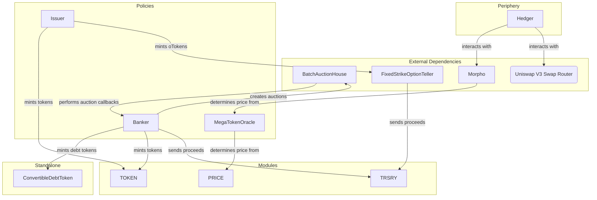

# MegaStrategy

MegaStrategy is a decentralized system designed to become the largest onchain treasury of Ethereum. Treasury growth is fueled by a positive feedback loop and turbocharged by reactor-grade volatility.

## Architecture

The protocol is built around the [Default framework](https://github.com/fullyallocated/Default), which provides a modular architecture for building DeFi protocols.

## Developer

### Setup

1. Install `forge`: [https://getfoundry.sh](https://getfoundry.sh)
    - This should be the stable version, 0.3.0
2. Run `pnpm install` to install all npm and forge/soldeer dependencies
3. A wallet must be configured with `cast wallet` before deploying or interacting with the system.

### Modules

#### TRSRY

The TRSRY module allows for the management of protocol reserves. Apart from custodying the assets, it tracks the following:

-   the amount of reserves that can be withdrawn by specific addresses (`withdrawApproval`)
-   the amount of reserves that can be borrowed by specific addresses (`debtApproval`)
-   the total amount of reserves borrowed as debt (`totalDebt`)
-   the amount of debt for a specific token and debtor address (`reserveDebt`)

When issuing tokens, the `Banker` and `Issuer` policies seek pre-approval from the TRSRY module to withdraw reserves. In the case where the TRSRY module is upgraded, the existing approvals will need to be migrated, otherwise the `Banker` and `Issuer` policies will not be able to convert/redeem tokens. The migration is not handled by the TRSRY module, so will need to be performed manually through a combination of event analysis and using `TreasuryCustodian` to set the approvals on the new module.

### Tasks

#### Deployment

Use the `script/deploy/deploy.sh` script to deploy the system.

The following must be performed to deploy and activate the system:

1. Copy the `.env.example` file to `.env` (or similar if using multiple chains) and populate with the correct values
2. Deploy the system using the `deploy.sh` script
3. Install the modules and policies into the Kernel using the `kernelInstallation.sh` script
4. Grant admin and manager roles using the `Tasks.s.sol` script
    - e.g. `forge script ./script/Tasks.s.sol --sig "addAdmin(string,address)()" base-sepolia <ADMIN_ADDRESS> --rpc-url <RPC_URL> --account <CAST_ACCOUNT> --sender <SIGNER_ADDRESS> --slow -vvv --broadcast`
5. Install the PRICE submodules by calling `installSubmodules()` in the `PriceConfiguration.s.sol` script
6. Configure the PRICE module using the `configureAssets()` function in the `PriceConfiguration.s.sol` script
7. Initialize the Banker using the `Tasks.s.sol` script

#### Launch Auction

After deployment, a launch auction needs to be created in order to accept wETH deposits in return for MGST.

This can be performed using the `shell/createLaunchAuction.sh` script.

The launch auction is configured to use a callback that has an allocated allowlist. The `setMerkleRoot()` function in the `LaunchAuction.s.sol` script must be called after auction creation to set the merkle root.

#### Convertible Debt Auctions

The Banker policy can create convertible debt auctions. The `shell/createBankerAuction.sh` script can be used to create an auction.

This script has additional requirements that need to be manually configured:

-   jq
-   The fleek CLI tool must be authenticated using `npx fleek login`
-   The fleek CLI tool must be configured to use the correct project using `npx fleek projects select`
-   Populating an environment file with the required values

To create the auction:

1. Create a JSON file with the auction details. See [script/auctions/IMG.json](script/auctions/IMG.json) for an example.
2. Run the `createBankerAuction.sh` script: `./shell/createBankerAuction.sh --account <CAST_ACCOUNT> --auctionFilePath <PATH_TO_AUCTION_FILE> --testnet <true|false> --broadcast <true|false>`

#### Options Issuance

The Issuer policy can issue options. The `script/Tasks.s.sol` script can be used to simplify this.

#### Morpho

##### MGST-USDC Market

The Hedger policy relies on a Morpho market for MGST-USDC. This needs to be created manually, and can be performed using the `createMgstMorphoMarket()` function in the `script/Morpho.s.sol` script.

##### cvToken-MGST Market

The Hedger policy relies on a Morpho market for each cvToken (cvToken-MGST). This needs to be created manually, and can be performed using the `createMgstDebtTokenMarket()` function in the `script/Morpho.s.sol` script.

This function will also add the cvToken-MGST market to the MetaMorpho market.

##### MGST MetaMorpho Market

To simplify the funding of the individual cvToken-MGST markets, a MetaMorpho market will be created. This will distribute deposited MGST amongst the individual cvToken-MGST markets.

The `createMgstMetaMorphoMarket()` function in the `script/Morpho.s.sol` script can be used to create the MetaMorpho market.
