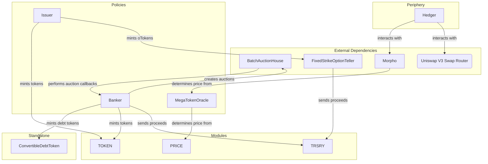

# MegaStrategy Audit

## Purpose

The MegaStrategy protocol aims to accumulate the largest on-chain treasury of ETH. It uses two tokens to achieve this:

-   Strategy Token (MGST): this token represents the treasury and provides leveraged exposure to ETH.
-   Convertible Tokens (cvTokens): convertible debt tokens that can be converted into MGST in pre-determined conditions.

In addition, the protocol can issue option tokens (oTokens) that can be converted into MGST at a pre-determined price.

The protocol is loosely based on MicroStrategy's approach to accumulating BTC, with on-chain automation and transparency.

The protocol team expects volatility in the price of MGST, and provides a mechanism for cvToken holders to hedge their position using Morpho markets.

## Previous Audits

### Olympus Bophades

The protocol builds upon the Bophades system in the Olympus protocol:

-   Kernel
-   Modules
    -   PRICE v2
    -   ROLES
    -   TRSRY
-   Policies
    -   Emergency
    -   PriceConfig v2
    -   RolesAdmin
    -   TreasuryCustodian

Audits are available here:

-   Olympus v3 (Bophades)
    -   [Spearbit Report](https://docs.olympusdao.finance/assets/files/OlympusDAO-1-1ec939694a04535f430fd977a133c77a.pdf)
    -   [CodeArena Report](https://code4rena.com/reports/2022-08-olympus)
-   PRICE v2 (as part of RBS 2.0)
    -   [Sherlock Report](https://docs.olympusdao.finance/assets/files/olympus_rbs2_audit_report-34c26d7cc13864ffc14b33acead60ad7.pdf)

### Bond Protocol

The protocol deploys contracts from Bond Protocol:

-   FixedStrikeOptionTeller
-   FixedStrikeOptionToken

Audits are available here:

-   Option tokens
    -   [Sherlock Report](https://github.com/Bond-Protocol/option-contracts/blob/master/audit/Bond_Options_Audit_Report.pdf)

## Scope

The following files are in scope:

-   [src/](../../src)
    -   [lib/](../../src/lib)
        -   [ConvertibleDebtToken.sol](../../src/lib/ConvertibleDebtToken.sol)
        -   [Uint2Str.sol](../../src/lib/Uint2Str.sol)
    -   [modules/](../../src/modules)
        -   [TOKEN/](../../src/modules/TOKEN)
            -   [MegaToken.sol](../../src/modules/TOKEN/MegaToken.sol)
            -   [TOKEN.v1.sol](../../src/modules/TOKEN/TOKEN.v1.sol)
    -   [periphery/](../../src/periphery)
        -   [Hedger.sol](../../src/periphery/Hedger.sol)
    -   [policies/](../../src/policies)
        -   [interfaces/](../../src/policies/interfaces)
            -   [IBanker.sol](../../src/policies/interfaces/IBanker.sol)
            -   [IIssuer.sol](../../src/policies/interfaces/IIssuer.sol)
            -   [IMegaTokenOracle.sol](../../src/policies/interfaces/IMegaTokenOracle.sol)
        -   [Banker.sol](../../src/policies/Banker.sol)
        -   [Issuer.sol](../../src/policies/Issuer.sol)
        -   [MegaTokenOracle.sol](../../src/policies/MegaTokenOracle.sol)

## Architecture

The protocol is built around the [Default framework](https://github.com/fullyallocated/Default), which provides a modular architecture for building DeFi protocols.

### Overview

### TOKEN (Module)

The TOKEN module represents the protocol token.

It is a standard ERC20 implementation with allowance-gated minting and burning functions.

-   Callers must be permissioned to mint tokens. In the current implementation, this is the Banker and Issuer policies.
-   It borrows from the [Olympus MINTR module](https://github.com/OlympusDAO/olympus-v3/blob/master/src/modules/MINTR/OlympusMinter.sol), which implements the concept of mint approvals.
-   Token holders can access the module directly to burn their tokens.

### Banker (Policy)

The Banker policy has a primary role of lifecycle management of cvToken auctions. The auctions are performed using Axis batch auctions, with the Banker policy acting as the callback handler.

Related to this are additional roles:

-   Creation and minting of cvTokens
    -   This can be performed by the "manager" role, as well as the policy itself.
-   Redemption of cvTokens (after maturity) for the underlying assets
-   Conversion of cvTokens to MGST (before maturity)

### Issuer (Policy)

The primary role of the Issuer policy is to create and mint option tokens (oTokens) that can be converted into MGST at a pre-determined price.

Unlike the Banker policy, conversion of the oTokens is handled by the FixedStrikeOptionTeller contract.

### Hedger (Periphery)

The Hedger contract is a periphery contract that simplifies interacting with Morpho markets. On behalf of a user, it can:

-   Deposit/withdraw cvTokens into Morpho markets
-   Increase/decrease the hedged position
    -   This borrows MGST against the cvToken collateral, swaps it for the reserve token and supplies it into the MGST-RESERVE Morpho market.

### MegaTokenOracle (Policy)

Each Morpho market requires an oracle in order to determine the price of the collateral token. This policy is set as the oracle for the MGST-RESERVE Morpho market.

It uses the PRICE module to determine the price of MGST in terms of the configured reserve token for the Morpho market.
